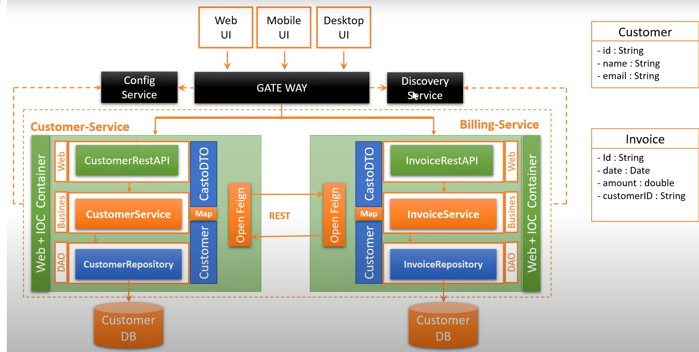

### VERSION 1.0.0-SNAPSHOT
- Développeurs : Redha CHAOU
- swagger : http://localhost:8081/swagger-ui/index.html?configUrl=/v3/api-docs/swagger-config#/
- Architectures Micro-Services - Use case - Customer-Service
    - Services métier
    - Service d’enregistrement et de découverte de services
    - Service de configuration
    - Service Gateway
    - Modèle Impératif avec IO Bloquantes
    - Création des micros-service métiers en mode express basés sur JPA, Spring Data, Spring Data Rest, H2 Data base

# Modules :

- [rcfactory-billing-service](git@github.com:chaouredha/rcfactory-billing-service.git)
- [rcfactory-customer-service](git@github.com:chaouredha/rcfactory-customer-service.git)
- [rcfactory-eureka-service](git@github.com:chaouredha/rcfactory-eureka-service.git)
- [rcfactory-gateway](git@github.com:chaouredha/rcfactory-gateway.git)

- Architectures :

